# AIops 智能运维平台 — 架构图全集

> 所有图表使用 Mermaid 语法，支持 GitHub / GitLab / Typora / VS Code 等工具直接渲染。

---

## 1. 总体架构图（System Architecture）

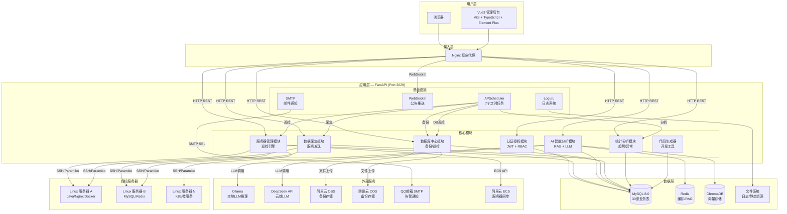

---

## 2. 模块架构图（Module Architecture）

```mermaid
flowchart TB
    subgraph 路由层["路由层 Router — 参数校验 + 调用 Service"]
        direction LR
        AuthRouter["auth/routes/<br/>13个路由文件<br/>用户/角色/菜单/部门/岗位<br/>公告/日志/仪表盘"]
        ServerRouter["server/router/<br/>8个路由文件<br/>服务器/凭证/SSH/阿里云<br/>巡检/告警/规则/配置"]
        AIRouter["ai/router/<br/>3个路由文件<br/>AI分析/RAG/日志分析<br/>DB助手"]
        DBCenterRouter["dbcenter/router/<br/>12个路由文件<br/>数据库/认证/表/备份<br/>策略/复制/校验/巡检<br/>OSS/COS"]
        CollectorRouter["collector/router/<br/>1个路由文件<br/>采集任务/统计"]
        StatisticsRouter["statistics/router/<br/>2个路由文件<br/>统计查询/分析记录"]
        CodegenRouter["codegen/router/<br/>1个路由文件<br/>表查询/预览/下载"]
    end

    subgraph 业务层["业务层 Service — 核心业务逻辑"]
        direction LR
        AuthService["auth/service/<br/>用户CRUD/角色管理<br/>菜单树/部门树<br/>登录认证/审计日志"]
        ServerService["server/service/<br/>巡检引擎/告警聚合<br/>规则评估/邮件通知<br/>SSH执行/阿里云同步"]
        AIService["ai/service/<br/>RAG引擎/AI分析<br/>日志分析/DB助手<br/>LLM编排"]
        DBCenterService["dbcenter/service/<br/>备份调度/恢复<br/>校验/清理/巡检<br/>云存储适配"]
        CollectorService["collector/service/<br/>采集调度/服务发现<br/>指标解析"]
        StatisticsService["statistics/service/<br/>统计聚合/趋势分析<br/>异常检测/评分"]
        CodegenService["codegen/service/<br/>表反射/Jinja2渲染<br/>Zip打包"]
    end

    subgraph 数据模型层["数据模型层 Model — SQLAlchemy 2.0 异步ORM"]
        direction LR
        AuthModel["auth/model/<br/>11张表<br/>sys_user/sys_role<br/>sys_menu/sys_dept<br/>sys_post/sys_icon<br/>关联表/日志表/公告表"]
        ServerModel["server/model/<br/>6张表<br/>ops_server/ops_credential<br/>ops_service_patrol<br/>ops_alarm/ops_patrol_rule<br/>ops_patrol_service_config"]
        AIModel["ai/model/<br/>2张表<br/>rag_documents<br/>rag_chunks"]
        DBCenterModel["dbcenter/model/<br/>9张表<br/>ops_database/auth/table<br/>backup/policy/replication<br/>check_config/check_record"]
        CollectorModel["collector/model/<br/>2张表<br/>ops_collector_record<br/>ops_collector_detail"]
        StatisticsModel["statistics/model/<br/>1张表<br/>ops_analysis_record"]
        CommonModel["common/model/<br/>1张表<br/>ops_system_config"]
    end

    subgraph 公共基础设施["公共基础设施"]
        direction LR
        CommonBase["common/<br/>BaseVO/异常处理<br/>WebSocket管理器<br/>统一响应封装"]
        Config["config/<br/>MySQL/Redis/LLM<br/>日志/OSS/COS/备份"]
        Util["util/<br/>JWT工具/日志装饰器<br/>SSH客户端/SSH隧道<br/>随机工具"]
    end

    AuthRouter --> AuthService
    ServerRouter --> ServerService
    AIRouter --> AIService
    DBCenterRouter --> DBCenterService
    CollectorRouter --> CollectorService
    StatisticsRouter --> StatisticsService
    CodegenRouter --> CodegenService

    AuthService --> AuthModel
    ServerService --> ServerModel
    AIService --> AIModel
    DBCenterService --> DBCenterModel
    CollectorService --> CollectorModel
    StatisticsService --> StatisticsModel
    CodegenService --> CommonModel

    AuthService --> CommonBase
    ServerService --> Util
    AIService --> Config
    DBCenterService --> Util
    CollectorService --> Util
```

---

## 3. 数据流图（Data Flow）

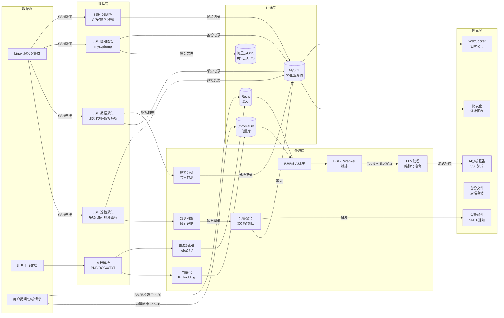

---

## 4. AI 分析流程图（核心卖点）

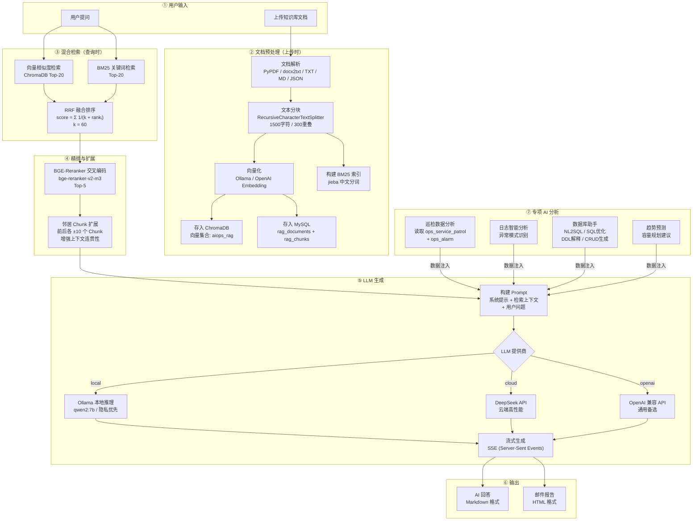

---

## 5. 数据库 ER 图（Entity Relationship）

```mermaid
erDiagram
    %% ========== AUTH 模块 ==========
    sys_user {
        bigint id PK
        varchar username UK
        varchar password
        varchar name
        varchar email
        varchar phone
        int sex
        varchar head_url
        bigint dept_id FK
        bigint post_id FK
        int status
        int is_deleted
    }
    sys_role {
        bigint id PK
        varchar role_name
        int role_type
        varchar role_code
        varchar description
    }
    sys_menu {
        bigint id PK
        bigint parent_id FK
        varchar name
        int type "0目录 1菜单 2按钮"
        varchar path
        varchar component
        varchar perms
        varchar icon
        int sort_value
    }
    sys_dept {
        bigint id PK
        bigint parent_id FK
        varchar name
        varchar tree_path
        int sort_value
        varchar leader
    }
    sys_post {
        bigint id PK
        varchar post_code
        varchar post_name
        int status
    }
    sys_user_role {
        bigint id PK
        bigint user_id FK
        bigint role_id FK
        bigint application_id
    }
    sys_role_menu {
        bigint id PK
        bigint role_id FK
        bigint menu_id FK
    }
    sys_announcement {
        bigint id PK
        varchar title
        text content
        varchar publisher
        varchar ann_type "daily/biz/iteration"
        int notify_now
        int status
    }
    sys_login_log {
        bigint id PK
        varchar username
        varchar ipaddr
        varchar address
        int status
        varchar browser
        datetime access_time
    }
    sys_oper_log {
        bigint id PK
        varchar title
        int business_type
        varchar method
        varchar oper_url
        varchar oper_ip
        int status
        text error_msg
        datetime oper_time
    }

    %% ========== SERVER 模块 ==========
    ops_server {
        bigint id PK
        varchar hostname
        varchar ip
        varchar intranet_ip
        varchar env
        int status "0离线 1在线 2维护"
        int patrol_enabled
        int alarm_email_enabled
        bigint leader_id
    }
    ops_credential {
        bigint id PK
        bigint server_id FK
        varchar credential_name
        int auth_type "1密码 2密钥"
        varchar username
        text password "AES加密"
        int port
    }
    ops_service_patrol {
        bigint id PK
        bigint server_id FK
        varchar service_name
        int status "0停止 1运行"
        int inspection_result "1正常 2异常"
        decimal cpu_usage
        decimal memory_usage
        decimal disk_usage
        datetime last_check_time
    }
    ops_alarm {
        bigint id PK
        bigint server_id FK
        varchar alarm_type_name
        varchar alarm_level "high/medium/low"
        text alarm_content
        int status "0未处理 1已处理"
        bigint service_patrol_id FK
        varchar aggregation_key
        int aggregation_count
    }
    ops_patrol_rule {
        bigint id PK
        varchar rule_name
        varchar rule_type "system/service/mysql/redis"
        varchar metric_key
        varchar operator
        decimal threshold_value
        varchar alarm_level
        int enabled
    }
    ops_patrol_service_config {
        bigint id PK
        bigint server_id FK
        varchar service_name
        varchar service_type_name
        int port
        varchar install_path
        varchar log_path
    }

    %% ========== AI 模块 ==========
    rag_documents {
        bigint id PK
        varchar filename
        varchar file_type
        bigint file_size
        int chunk_count
        int status "0处理中 1就绪 2失败"
    }
    rag_chunks {
        bigint id PK
        bigint document_id FK
        int chunk_index
        text content
        varchar chroma_id
        int token_count
    }

    %% ========== DBCENTER 模块 ==========
    ops_database {
        bigint id PK
        bigint server_id FK
        varchar name
        varchar db_type
        varchar host
        int port
        int status
        varchar version
        int table_count
    }
    ops_database_auth {
        bigint id PK
        bigint database_id FK
        varchar username
        text password "AES加密"
        int auth_type
        int ssl_enable
    }
    ops_database_table {
        bigint id PK
        bigint database_id FK
        varchar table_name
        bigint table_rows
        bigint data_length
        varchar engine
        varchar table_comment
    }
    ops_database_backup {
        bigint id PK
        bigint database_id FK
        varchar backup_name
        varchar backup_type "full/incremental"
        varchar backup_path
        bigint file_size
        int status "0运行 1成功 2失败"
        int verify_status
    }
    ops_database_backup_policy {
        bigint id PK
        bigint database_id FK "1:1"
        int retention_days
        int enable_compression
        int enable_verify
        int status
    }
    ops_backup_replication {
        bigint id PK
        bigint policy_id FK
        varchar target_type "oss/cos/minio/s3"
        varchar endpoint
        varchar bucket
        varchar region
        int enabled
    }
    ops_backup_replication_log {
        bigint id PK
        bigint backup_id FK
        bigint replication_id FK
        int sync_status "0未同步 1成功 2失败"
        varchar target_key
    }
    ops_database_check_config {
        bigint id PK
        bigint database_id FK "1:1"
        int enabled
        json check_items
        int enable_ai_analysis
    }
    ops_database_check_record {
        bigint id PK
        bigint database_id FK
        datetime check_time
        int duration_ms
        int health_score
        int check_status
        text ai_analysis_result
    }

    %% ========== COLLECTOR 模块 ==========
    ops_collector_record {
        bigint id PK
        bigint server_id FK
        varchar task_type "manual/scheduled"
        varchar status "running/completed/failed"
        json services_discovered
        int total_services
        datetime start_time
    }
    ops_collector_detail {
        bigint id PK
        bigint record_id FK
        bigint server_id FK
        varchar service_name
        varchar service_type
        json metrics_info
        json config_info
    }

    %% ========== STATISTICS 模块 ==========
    ops_analysis_record {
        bigint id PK
        bigint collector_record_id FK
        bigint server_id FK
        varchar service_type
        varchar analysis_type "resource/capacity/trend"
        decimal analysis_value
        int health_score
        varchar trend "up/down/stable/spike"
        varchar warning_level
    }

    %% ========== COMMON 模块 ==========
    ops_system_config {
        bigint id PK
        varchar config_key UK
        text config_value
        varchar component_tag
        int enabled
        varchar description
    }

    %% ========== 关系 ==========
    sys_user }o--o{ sys_dept : "dept_id"
    sys_user }o--o{ sys_post : "post_id"
    sys_user }o--o{ sys_role : "sys_user_role"
    sys_role }o--o{ sys_menu : "sys_role_menu"
    sys_menu ||--o{ sys_menu : "parent_id"
    sys_dept ||--o{ sys_dept : "parent_id"

    ops_server ||--o{ ops_credential : "server_id"
    ops_server ||--o{ ops_service_patrol : "server_id"
    ops_server ||--o{ ops_alarm : "server_id"
    ops_server ||--o{ ops_patrol_service_config : "server_id"
    ops_service_patrol ||--o{ ops_alarm : "service_patrol_id"

    rag_documents ||--o{ rag_chunks : "document_id"

    ops_server ||--o{ ops_database : "server_id"
    ops_database ||--o{ ops_database_auth : "database_id"
    ops_database ||--o{ ops_database_table : "database_id"
    ops_database ||--o{ ops_database_backup : "database_id"
    ops_database ||--|| ops_database_backup_policy : "database_id 1:1"
    ops_database ||--|| ops_database_check_config : "database_id 1:1"
    ops_database ||--o{ ops_database_check_record : "database_id"
    ops_database_backup_policy ||--o{ ops_backup_replication : "policy_id"
    ops_database_backup ||--o{ ops_backup_replication_log : "backup_id"
    ops_backup_replication ||--o{ ops_backup_replication_log : "replication_id"

    ops_server ||--o{ ops_collector_record : "server_id"
    ops_collector_record ||--o{ ops_collector_detail : "record_id"
    ops_server ||--o{ ops_collector_detail : "server_id"

    ops_server ||--o{ ops_analysis_record : "server_id"
    ops_collector_record ||--o{ ops_analysis_record : "collector_record_id"
```

---

## 6. 时序图（Sequence Diagram）

### 6.1 服务巡检完整流程

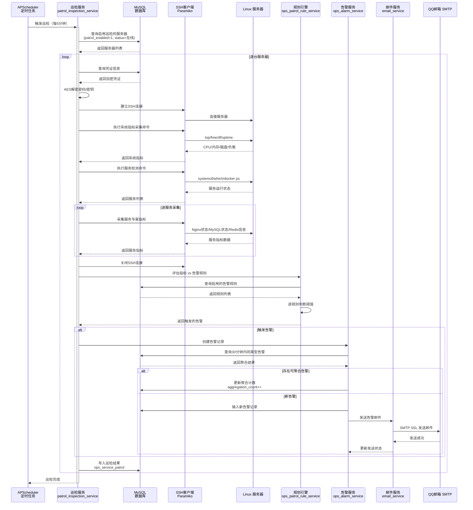

### 6.2 用户登录与权限校验

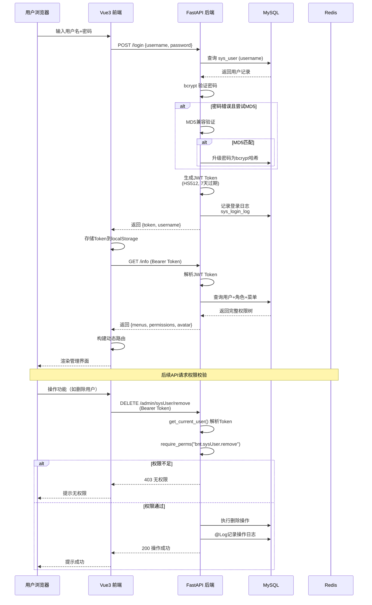

---

## 7. 部署图（Deployment）

```mermaid
graph TB
    subgraph 用户端["用户端"]
        PC[PC 浏览器]
        Mobile[移动端浏览器]
    end

    subgraph 反向代理["反向代理层"]
        Nginx["Nginx<br/>静态资源 + API 转发<br/>SSL 终结"]
    end

    subgraph DockerHost["Docker 宿主机"]
        subgraph Container["Docker Container: aiops-backend"]
            FastAPI["FastAPI + Uvicorn<br/>Port 2029<br/>多Worker模式"]
            APScheduler2["APScheduler<br/>7个定时任务"]
            WebSocket2["WebSocket<br/>公告推送"]
            Loguru2["Loguru<br/>日志输出"]
        end
        Volume["Volume 挂载<br/>logs/ → /app/logs"]
    end

    subgraph 宿主机服务["宿主机服务（非容器化）"]
        MySQL2["MySQL 8.0<br/>Port 3306<br/>30张业务表"]
        Redis2["Redis 6.0+<br/>Port 6379<br/>缓存 + RAG"]
        Ollama2["Ollama<br/>Port 11435<br/>本地LLM推理"]
    end

    subgraph 目标服务器集群["目标服务器集群（SSH管理）"]
        ServerA["服务器 A<br/>Java / Nginx / Docker"]
        ServerB["服务器 B<br/>MySQL / Redis"]
        ServerC["服务器 C<br/>K8s / 微服务"]
    end

    subgraph 云服务["外部云服务"]
        OSS["阿里云 OSS<br/>备份文件存储"]
        COS["腾讯云 COS<br/>备份文件存储"]
        AliyunECS2["阿里云 ECS API<br/>服务器自动同步"]
        DeepSeek2["DeepSeek API<br/>云端LLM"]
        QQMail["QQ邮箱 SMTP<br/>告警邮件"]
    end

    subgraph 持久化存储["持久化存储"]
        ChromaDBDir["chroma_db/<br/>ChromaDB 向量持久化"]
        StaticDir["static/<br/>公告图片/静态资源"]
        LogDir["logs/<br/>info.log / error.log<br/>按天滚动, 30天保留"]
    end

    PC --> Nginx
    Mobile --> Nginx
    Nginx -->|"/ → Vue3 SPA"| FastAPI
    Nginx -->|"/admin/* → API"| FastAPI

    FastAPI -->|host.docker.internal| MySQL2
    FastAPI -->|异步连接| Redis2
    FastAPI -->|HTTP| Ollama2
    FastAPI -->|HTTP| DeepSeek2

    APScheduler2 -->|SSH/Paramiko| ServerA
    APScheduler2 -->|SSH/Paramiko| ServerB
    APScheduler2 -->|SSH/Paramiko| ServerC

    FastAPI -->|SDK| OSS
    FastAPI -->|SDK| COS
    FastAPI -->|REST API| AliyunECS2
    FastAPI -->|SMTP SSL| QQMail

    FastAPI --> ChromaDBDir
    FastAPI --> StaticDir
    Loguru2 --> LogDir
    Container --- Volume
```

---

## 8. 日志架构图（Logging Architecture）

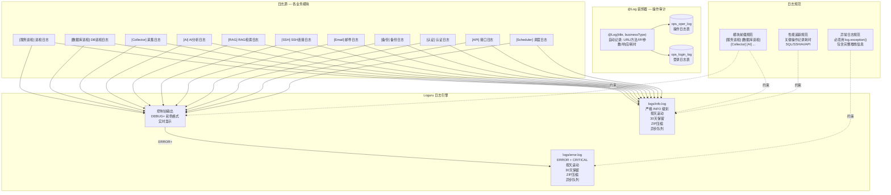

---

## 9. 告警流程图（Alert/Alarm Flow）

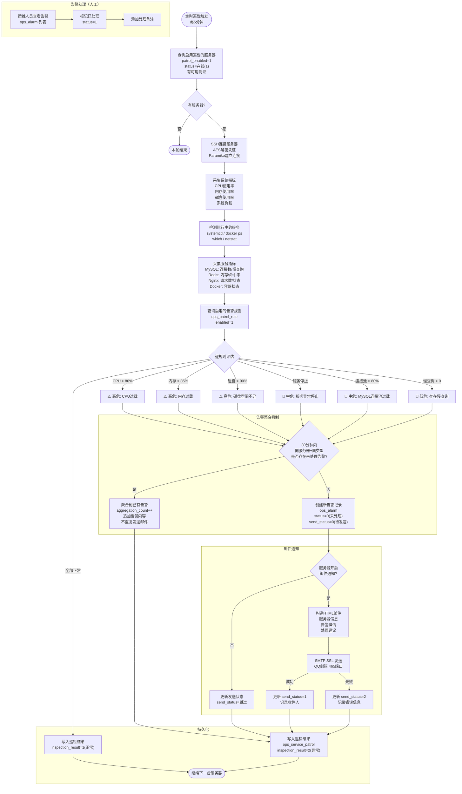

---

## 10. 权限 RBAC 图（Role-Based Access Control）

```mermaid
flowchart TD
    subgraph 用户管理["用户管理"]
        User1["管理员 (admin)<br/>user_id=1<br/>超级管理员"]
        User2["运维人员 A<br/>运维角色"]
        User3["开发人员 B<br/>开发角色"]
        User4["只读用户 C<br/>访客角色"]
    end

    subgraph 组织架构["组织架构"]
        Dept1["技术部"]
        Dept2["运维组"]
        Dept3["开发组"]
        Dept1 --> Dept2
        Dept1 --> Dept3
    end

    subgraph 岗位["岗位"]
        Post1["运维工程师"]
        Post2["开发工程师"]
        Post3["技术经理"]
    end

    subgraph 角色["角色 (sys_role)"]
        Role1["超级管理员<br/>role_type=0<br/>所有权限"]
        Role2["运维管理员<br/>role_type=2<br/>服务器/巡检/告警"]
        Role3["DBA管理员<br/>role_type=2<br/>数据库/备份"]
        Role4["普通用户<br/>role_type=1<br/>只读权限"]
    end

    subgraph 菜单权限["菜单权限 (sys_menu)"]
        direction TB
        subgraph 目录["目录 (type=0)"]
            Menu_System["系统管理"]
            Menu_Server["服务器管理"]
            Menu_AI["AI 智能"]
            Menu_DB["数据库中心"]
            Menu_Stats["统计分析"]
        end

        subgraph 菜单["菜单 (type=1)"]
            Menu_User["用户管理"]
            Menu_Role["角色管理"]
            Menu_Menu["菜单管理"]
            Menu_ServerList["服务器列表"]
            Menu_Patrol["巡检记录"]
            Menu_Alarm["告警管理"]
            Menu_Rule["告警规则"]
            Menu_RAG["知识库"]
            Menu_Analysis["AI分析"]
            Menu_DBList["数据库列表"]
            Menu_Backup["备份管理"]
            Menu_Inspection["DB巡检"]
            Menu_Dashboard["数据看板"]
        end

        subgraph 按钮权限["按钮权限 (type=2)"]
            Btn_UserList["bnt.sysUser.list"]
            Btn_UserAdd["bnt.sysUser.add"]
            Btn_UserEdit["bnt.sysUser.edit"]
            Btn_UserDel["bnt.sysUser.remove"]
            Btn_ServerAdd["bnt.server.add"]
            Btn_ServerEdit["bnt.server.edit"]
            Btn_ServerDel["bnt.server.remove"]
            Btn_PatrolList["bnt.patrol.list"]
            Btn_AlarmHandle["bnt.alarm.handle"]
            Btn_BackupAdd["bnt.backup.add"]
            Btn_BackupDel["bnt.backup.remove"]
            Btn_RAGUpload["bnt.rag.upload"]
        end
    end

    subgraph 权限校验["运行时权限校验"]
        JWTDecode["JWT Token 解析<br/>get_current_user()"]
        PermCheck["权限检查<br/>require_perms()<br/>超管(user_id=1)跳过"]
        Allow["✅ 允许操作"]
        Deny["❌ 403 拒绝"]
    end

    User1 --> Role1
    User2 --> Role2
    User3 --> Role3
    User4 --> Role4

    User2 --> Dept2
    User3 --> Dept3
    User2 --> Post1
    User3 --> Post2

    Role1 -.->|所有菜单| Menu_System
    Role1 -.->|所有菜单| Menu_Server
    Role1 -.->|所有菜单| Menu_AI
    Role1 -.->|所有菜单| Menu_DB
    Role1 -.->|所有菜单| Menu_Stats

    Role2 --> Menu_Server
    Role2 --> Menu_Patrol
    Role2 --> Menu_Alarm
    Role2 --> Menu_Rule

    Role3 --> Menu_DBList
    Role3 --> Menu_Backup
    Role3 --> Menu_Inspection

    Role4 --> Menu_Dashboard
    Role4 --> Btn_PatrolList

    Menu_User --> Btn_UserList
    Menu_User --> Btn_UserAdd
    Menu_User --> Btn_UserEdit
    Menu_User --> Btn_UserDel
    Menu_ServerList --> Btn_ServerAdd
    Menu_ServerList --> Btn_ServerEdit
    Menu_ServerList --> Btn_ServerDel
    Menu_Alarm --> Btn_AlarmHandle
    Menu_Backup --> Btn_BackupAdd
    Menu_Backup --> Btn_BackupDel
    Menu_RAG --> Btn_RAGUpload

    Btn_UserList --> JWTDecode
    Btn_ServerAdd --> JWTDecode
    JWTDecode --> PermCheck
    PermCheck -->|有权限| Allow
    PermCheck -->|无权限| Deny
```

---

> **维护说明**：
> - 数据流图（第3张）随模块交互变更需优先更新
> - AI分析流程图（第4张）为核心卖点，新增分析能力时同步更新
> - ER图（第5张）随数据库表变更需同步更新
> - 所有图表最后更新：2026-07-19
